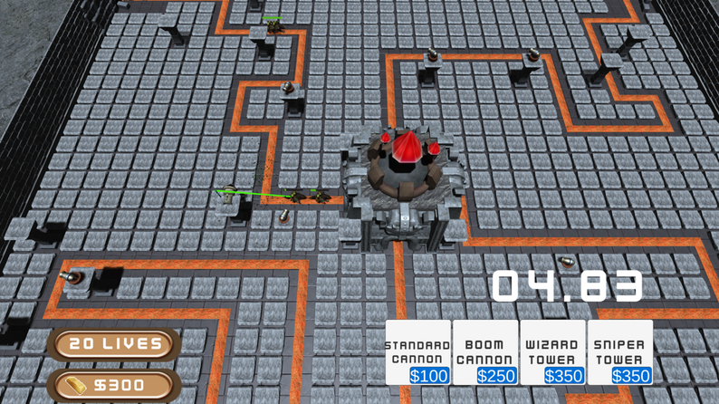

# Ourghs Vs.Dwarves:

### Project Summary:

MSCH-G300 Production I, Final Project.
 

Made using the [Brackey's tutorial](https://www.youtube.com/watch?v=beuoNuK2tbk&ab_channel=Brackeys) for a 3D tower defense as a base, with a restructing to be based off fantasy rather than sci-fi, and was produced in Unity 2019.4.17f.

### Development Process:

This was a completely solo project where I had cpontrol over aspect of the game. I was the equivalent to the artist, programmer, builder, tester, and more over the course of the making of the project.  

This particular project was interesting to deal with as we were tasked with finding and adapting a tutorial. While ther wer esignficant advnatages for having done this, there was sometimes brutal tradeoffs in restructuring a whole project to adapt it for another similar, but still different purpose. 

### Lessons Learned:

I learned a lot over the course of this project.  

It was here where Object-Oriented programming really began to click in my mind. New doors in terms of game complexity were opened with just a few examples given to me, also thanks to the class and teachers I had as well. 

This project ultimately represents a milestone in my progress as a programmer where I implemneted strong coding principles such as the singleton pattern, and AI behavior, while I also picked up great experience towards my longterm goal of being a Technical Artist. 

This is because over the course of the project I learned a lot about not only materials, but also 3D particle effects and how to manipulate their variables for best effects.

### Repository Link:

[SourceTree Repository](https://bitbucket.org/Xwartu/tonner_g300final/src/master/)

### Itch.io Link:

[Itch.io Link](https://xwartu.itch.io/ourghs-vs-dwarves)

### Images:

 

[Back to Home Page](./)

